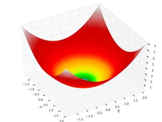
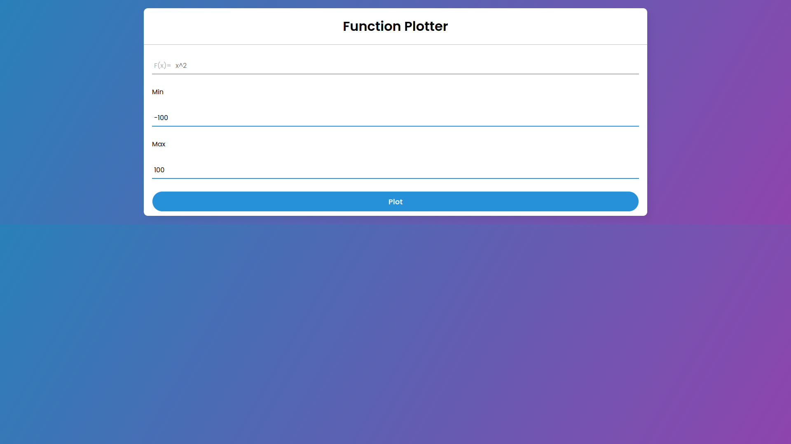
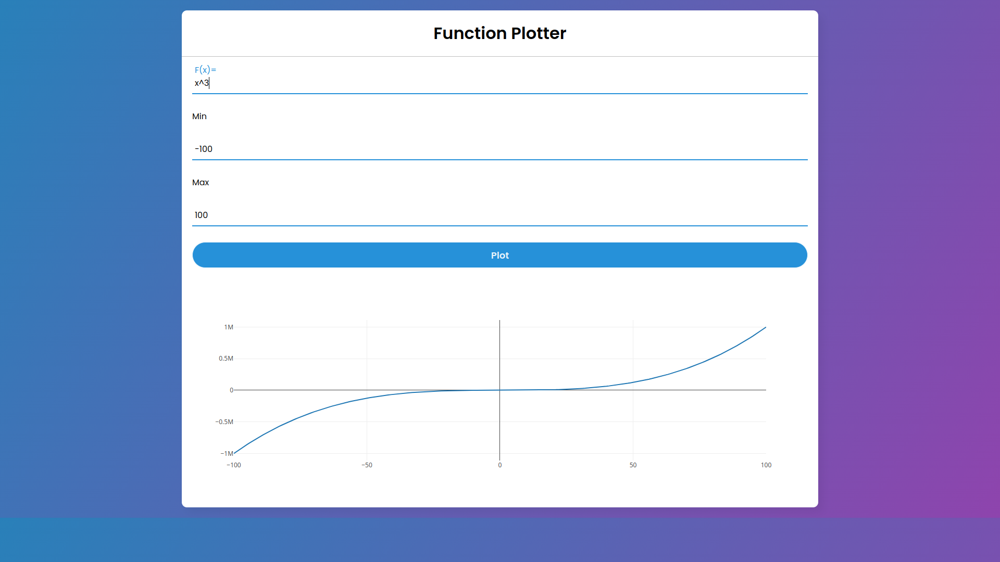
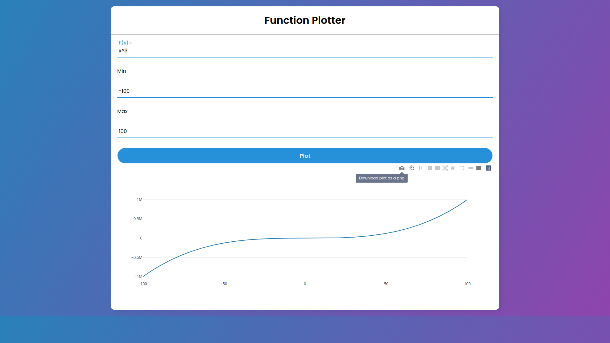
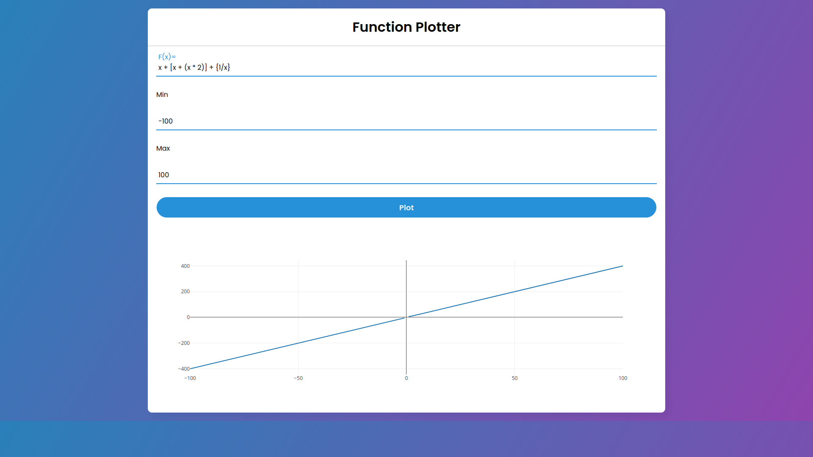

# Function Plotter



Function Plotter is an interactive mathematical function plotter, and a cross platform GUI application built with [ElectronJs](https://www.electronjs.org/) and could be hosted as website.

---

## Run as webpage

Run [index.html](https://github.com/YoussefMo7amed/functionPlotter/blob/main/src/GUI/index.html) file as live server.

---

## Prerequisites (For Desktop Application)

- [Node.js](https://nodejs.org/en/).
- [ElectronJs](https://www.electronjs.org)

```npm
npm i electron
```

then

```npm
npm start
```

---

## Build

This application created on Manjaro Linux operating system. So it is better to build it on your own platform (e.g. Windows or MacOS)

### Platform prerequisites

- Check the build prerequisites for your platform before proceeding
[macOS](https://www.electronjs.org/docs/latest/development/build-instructions-macos#prerequisites),
[Linux](https://www.electronjs.org/docs/latest/development/build-instructions-linux#prerequisites),
[Windows](https://www.electronjs.org/docs/latest/development/build-instructions-windows#prerequisites)

## Building

You can follow instructions [here](https://www.electronjs.org/docs/latest/development/build-instructions-gn)

---

## Features & Screenshots

- You can enter the mathematical function it supports (+, -, *, /, ^) operations.
    
- Plot function from minimum value to maximum Value.
    
- Zoom in and out using the mouse.
    
    
- The corresponding value appears when you move the mouse pointer around the curve.
    
- You can download the curve as png photo.
    
- You can add any parentheses types (), [] or {} and can add them together.
    
- If there is any error/s, it/they will be printed.
    
    

---

## License

Copyright (c) 2022 Youssef Mohamed.

[](https://raw.githubusercontent.com/YoussefMo7amed/functionPlotter/blob/main/LICENSE)

[](https://hits.seeyoufarm.com)
